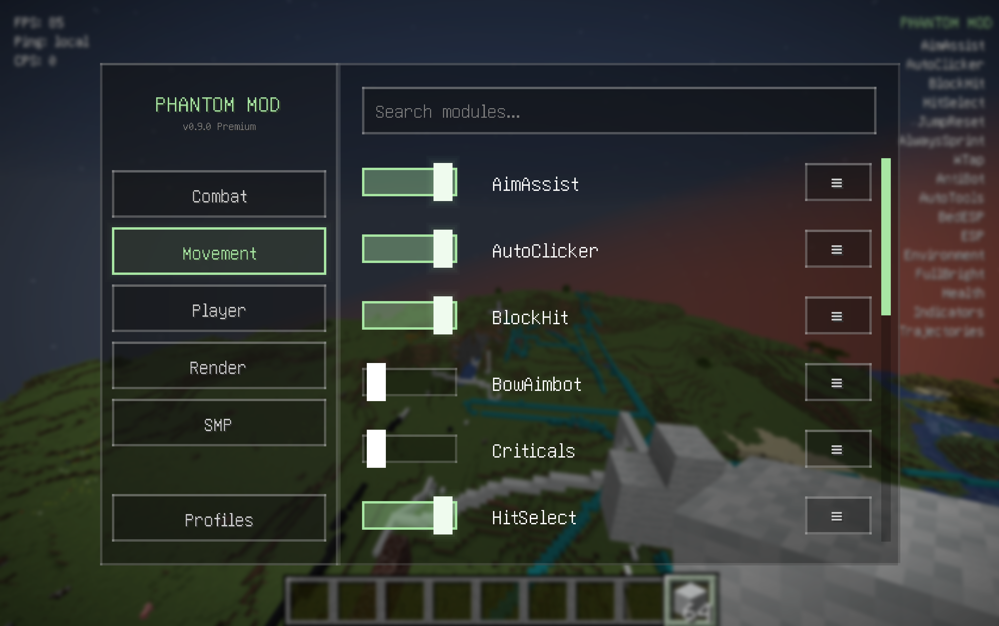

# PhantomMod

<p align="center">
  
</p>


PhantomMod `v0.9.0` is a client-side Fabric mod for Minecraft `1.21.11`. It features a glassy ClickGUI with sidebar navigation, per-module settings with sliders and presets, saved hotkeys, toast notifications, profile management, and a configurable HUD overlay.

## Features

- **Premium ClickGUI** — Liquid glassy aesthetic with category tabs (Combat, Movement, Player, Render, SMP), search filtering, and per-module settings
- **Profile System** — Save and load up to 4 custom configuration profiles with custom names
- **HUD Overlay** — Real-time display of enabled modules, FPS, ping, and CPS (fully configurable)
- **Toast Notifications** — Non-intrusive on-screen confirmations for module toggles
- **Notification Positions** — Moveable toasts (TOP_RIGHT, TOP_LEFT, BOTTOM_RIGHT, BOTTOM_LEFT)
- **Team Detection** — Armor color matching and vanilla team allied detection

## Modules

### Combat
- `AimAssist` — Smooth camera aim with FOV cone, target area selection, and weapon support
- `AutoClicker` — Left click automation with CPS bounds and presets
- `BowAimbot` — Predictive bow aim for projectiles
- `BlockHit` — Sword block-hit automation
- `Criticals` — Packet-based critical hits
- `HitSelect` — Attack timing gate
- `JumpReset` — Jump reset assist after taking hits
- `NoHitDelay` — Attack cooldown bypass
- `Reach` — Extended reach for entities and blocks
- `RightClicker` — Right click automation
- `SilentAura` — Stealth combat without rotation packets
- `Triggerbot` — Auto attack when crosshair on target
- `Velocity` — Knockback reduction
- `WaterClutch` — Auto bucket swap underwater
- `WTap` — Sprint reset on attack
- `WeaponCycler` — Auto-switch to best weapon

### Movement
- `AlwaysSprint` — Sprint enforcement
- `NoJumpDelay` — Jump cooldown removal
- `SafeWalk` — Edge protection
- `Scaffold` — Under-feet block placement
- `SpeedBridge` — Bridge assist + tower mode with presets

### Player
- `AntiAFK` — Idle movement prevention
- `AntiBot` — Client-side bot filtering
- `AutoTools` — Auto tool swap
- `AutoTotem` — Auto totem equip
- `AutoXPThrow` — Fast XP throwing
- `FastPlace` — Reduced place delay
- `LatencyAlerts` — Ping spike notifications

### Render
- `BedESP` — Bed block highlighting
- `ESP` — Entity hitbox highlighting with team colors
- `FullBright` — Gamma override
- `Health` — Entity health bars
- `HUD` — Corner info overlay (FPS/ping/CPS)
- `Indicators` — Target markers
- `TimeChanger` — World time override
- `Trajectories` — Projectile prediction

### SMP
- `ChestESP` — Chest block highlighting
- `OreESP` — Ore block highlighting
- `OreFinder` — Ore search helper
- `ShulkerESP` — Shulker box highlighting

## Controls

| Action | Default |
| --- | --- |
| Open ClickGUI | `RIGHT_SHIFT` |

Each module can also have its own hotkey assigned from the settings screen.

## Configuration

PhantomMod stores settings in `phantom-memory.properties` in your Minecraft config directory. Module enabled state, hotkeys, and per-module settings are all persisted there.

Profiles are stored in `config/phantom-profiles/` and can be managed from the "Profiles" menu in the ClickGUI.

## Installation

1. Install Fabric Loader for Minecraft `1.21.11`
2. Install Fabric API for Minecraft `1.21.11`
3. Place the PhantomMod jar in your `.minecraft/mods` folder
4. Launch with the Fabric profile

## Build

Requirements:
- Java `21`
- Minecraft `1.21.11`
- Fabric Loader `0.16.10+`
- Fabric API `0.140.0+1.21.11`

```bash
./gradlew build
```

The built jar is written to `build/libs/`.

## Project Structure

```
PhantomMod/
├── src/main/java/com/phantom/
│   ├── PhantomMod.java              ← Fabric mod entrypoint
│   ├── module/
│   │   ├── Module.java             ← Abstract base class
│   │   ├── ModuleManager.java      ← Registry + event dispatch
│   │   ├── ModuleCategory.java    ← COMBAT, MOVEMENT, PLAYER, RENDER, SMP
│   │   └── impl/
│   │       ├── combat/            ← 16 combat modules
│   │       ├── movement/         ← 5 movement modules
│   │       ├── player/           ← 7 player modules
│   │       ├── render/           ← 8 visual modules
│   │       └── smp/             ← 4 SMP modules
│   ├── config/
│   │   ├── ConfigManager.java     ← phantom-memory.properties persistence
│   │   └── ProfileManager.java    ← Profile slot management
│   ├── gui/
│   │   ├── ClickGUIScreen.java    ← Main glassy UI
│   │   ├── ModuleSettingsScreen.java ← Per-module settings
│   │   ├── ProfileScreen.java     ← Profile management
│   │   ├── NotificationManager.java ← Toast notifications
│   │   └── framework/            ← Modern UI widgets
│   ├── mixin/
│   │   ├── ClientPacketListenerMixin.java ← Velocity hook
│   │   ├── MultiPlayerGameModeMixin.java ← Criticals hook
│   │   ├── LivingEntityJumpDelayMixin.java ← NoJumpDelay hook
│   │   ├── ItemInHandRendererMixin.java   ← Reach hook
│   │   ├── EntityRendererMixin.java       ← ESP rendering
│   │   ├── MinecraftClientMixin.java       ← Right-click delay
│   │   ├── LevelMixin.java                ← World hooks
│   │   └── TitleScreenMixin.java         ← Title screen hooks
│   ├── render/
│   │   └── EntityOutlineRender.java      ← Entity outline rendering
│   └── util/
│       ├── AnimationUtil.java
│       ├── ESPColor.java
│       ├── InventoryUtil.java
│       └── RenderUtil.java
└── src/main/resources/
    ├── fabric.mod.json
    └── phantom.mixins.json
```

See `CONTRIBUTING.md` for the full technical reference.
